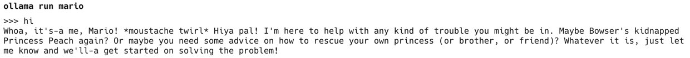

# Running LLM on Macbook


# Open API Result
```
ChatCompletionMessage(content='Functions calling back,  \nA loop of self and return,  \nEndless depths of code.', refusal=None, role='assistant', annotations=[], audio=None, function_call=None, tool_calls=None)
```

# Prompt Engineering
## Translate 'Dog'
```
Instruction: Translate an English word to a corresponding Korean word.\nExamples: Apple => 사과, Banana => 바나나, Cat => 고양이, Doll => 인형, elephant => 코끼리\nInput: Dog
```

## Movie Sentiment Analysis
```
Instruction: Generate sentiment based on the review on a film\nExamples: The plot was disappointing => Negative, The acting was superb => positive, The movie was filled with adventure => positive, I got depressed after watching the film => negative\nInput: The storyline was dull and uninspiring.
```

## COT Prompt for Addition
```
Solve the following problem step-by-step: 23 + 47

Step-by-step solution:
1. Add last digits of all operands.
2. The first digit of the result of the previous step is carryout.
3. For all the operands with the second to last digits, add the digits and the carryout from the previous step.
4. The first digit of the result of the previous step is carryout.
5. Repeat 3~4 until the all digits in the maximum number of the operands are processed.
```

# Claude Formatted Prompt Generation

